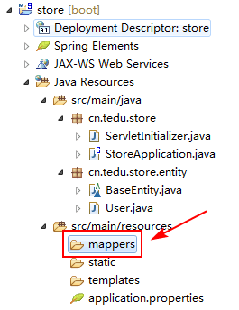

### 1. 分析项目

#### 1.1. 项目中涉及的数据

用户、商品、商品类别、收藏、购物车、收货地址、订单。

#### 1.2. 规划各种数据的开发顺序

规划顺序的原则是：**先开发基础数据**，例如：如果没有开发用户数据，就不可能完成订单等数据，则用户数据是必须先完成的！另外，如果某些数据之间没有交叉，那应该**先开发较简单的，再开发较难的**！

所以，以上数据的开发顺序应该是：用户 > 收货地址 > 商品分类 > 商品 > 收藏 > 购物车 > 订单。

#### 1.3. 规划各数据的相关功能

以**用户**数据为例，本项目中可能涉及的功能有：注册、登录、修改密码、修改资料、上传头像。

在开发之前，也应该规划一下这些功能的开发顺序，通常，遵守**增 > 查 > 删 > 改**的顺序。

#### 1.4. 每个功能的开发顺序

在处理每种不同的数据时，首先，应该完成：**创建数据表** > **创建实体类**。

然后，每个功能的开发顺序都应该是：**持久层** > **业务层** > **控制器层** > **前端页面**。

### 2. 用户-注册-创建数据表

由于现在是第1次创建，应该先创建数据库：

	CREATE DATABASE tedu_store;

并使用该数据库：

	USE tedu_store;

然后，创建数据表：

	CREATE TABLE t_user (
		uid INT AUTO_INCREMENT COMMENT '用户的id',
		username VARCHAR(20) NOT NULL UNIQUE COMMENT '用户名',
		password CHAR(32) NOT NULL COMMENT '密码',
		salt CHAR(36) COMMENT '盐值',
		avatar VARCHAR(50) COMMENT '头像',
		phone VARCHAR(20)  COMMENT '电话',
		email VARCHAR(50)  COMMENT '邮箱',
		gender INT COMMENT '性别，0-女，1-男',
		is_delete INT COMMENT '是否删除，0-未删除，1-已删除',
		created_user VARCHAR(20) COMMENT '创建者',
		created_time DATETIME COMMENT '创建时间',
		modified_user VARCHAR(20) COMMENT '最后修改者',
		modified_time DATETIME COMMENT '最后修改时间',
		PRIMARY KEY(uid)
	) DEFAULT CHARSET=UTF8;

创建完成后，从FTP服务器下载项目，解压到Workspace中，通过Eclipse的**Import** > **Existing Maven Projects**导入项目，导入完成后，必须先在`application.properties`中添加数据库连接的相关配置（从昨天的项目中复制配置代码，并修改url中的数据库名称），然后运行启动类`StoreApplication`，以确保项目的环境是正确的。

即便项目能运行，也并不代表数据库连接的配置是正确的，应该将昨天项目中的`ConnectionTestCase`复制到当前项目的`src/test/java`的`cn.tedu.store`包中，并执行昨天已经编写好的单元测试方法，如果能成功的在控制台输出连接对象，则表示数据库连接的配置是正确的。

### 3. 用户-注册-创建实体类

创建`cn.tedu.store.entity.BaseEntity`类：

	public class BaseEntity {
		private String createdUser;
		private Date createdTime;
		private String modifiedUser;
		private Date modifiedTime;
		// SET/GET/toString
	}

创建`cn.tedu.store.entity.User`类：

	public class User extends BaseEntity {
		// 与数据表字段匹配的属性，注意使用驼峰命名法，例如isDelete
		// SET/GET/toString
	}

由于`BaseEntity`是实体类的基类，其作用就是用于被继承的，所以，应该将其声明为抽象类。

由于`BaseEntity`只在当前包中使用（所有的实体类都应该在这个包中），所以，应该使用默认的访问权限。

由于`BaseEntity`及其子孙类都是描述数据属性的，所以，应该实现`Serializable`接口。

### 4. 用户-注册-持久层

#### 4.1. 准备工作

给mapper注解，两种方式可以共存
sql语句也可以在方法上方写和在xml中写，两种方式可以共存，但是一个方法却只能有一种sql语句的方式与之对应。
若要把sql语句写在xml中
首先，检查`application.properties`中是否存在配置：

	# mybatis
	mybatis.mapper-locations=classpath:mappers/*.xml

并检查在`src/main/resources`下是否存在名为`mappers`的文件夹，如果没有，则创建：

然后，在启动类`StoreApplication.java`的声明语句之前添加：

	@MapperScan("cn.tedu.store.mapper")

即：

	@SpringBootApplication
	@MapperScan("cn.tedu.store.mapper")
	public class StoreApplication {
	
		public static void main(String[] args) {
			SpringApplication.run(StoreApplication.class, args);
		}
	
	}
并且，后续在当前项目中创建的持久层接口文件都应该在`cn.tedu.store.mapper`这个包中。

#### 4.2. 规划SQL语句

此次执行的**注册**功能的数据操作应该是向数据表中插入新的数据，则SQL语句应该是：

	INSERT INTO t_user (除了uid以外的所有字段) VALUES (匹配的值);

除此以外，还应该在插入数据之前，检查用户名是否被占用，可以通过**根据用户名查询用户数据**，并判断查询结果是否为`null`来实现判断，该查询对应的SQL语句应该是：

	SELECT uid FROM t_user WHERE username=?

#### 4.3. 接口与抽象方法

当前是第一次处理用户相关数据，则需要先创建`cn.tedu.store.mapper.UserMapper`接口，并添加抽象方法：

	/**
	 * 处理用户数据的持久层接口
	 */
	public interface UserMapper {
	
		/**
		 * 插入用户数据
		 * @param user 用户数据
		 * @return 受影响的行数
		 */
		Integer insert(User user);
	
		/**
		 * 根据用户名查询用户数据
		 * @param username 用户名
		 * @return 匹配的用户数据，如果没有匹配的数据，则返回null
		 */
		User findByUsername(String username);
		
	}

#### 4.4. 配置XML映射

当前是第一次处理用户相关数据，则需要复制并得到`UserMapper.xml`，将其放在`mappers`文件夹下，并配置根节点`<mapper>`的`namespace`属性，其值是以上接口。

然后，配置以上2个方法对应的映射：

	<?xml version="1.0" encoding="UTF-8" ?>  
	<!DOCTYPE mapper PUBLIC "-//ibatis.apache.org//DTD Mapper 3.0//EN"      
		"http://ibatis.apache.org/dtd/ibatis-3-mapper.dtd">
	
	<mapper namespace="cn.tedu.store.mapper.UserMapper">
	
		<!-- 插入用户数据 -->
		<!-- Integer insert(User user) -->
		<insert id="insert" 
			useGeneratedKeys="true" 
			keyProperty="uid">
			INSERT INTO t_user (
				username, password,
				salt, avatar,
				phone, email,
				gender, is_delete,
				created_user, created_time,
				modified_user, modified_time
			) VALUES (
				#{username}, #{password},
				#{salt}, #{avatar},
				#{phone}, #{email},
				#{gender}, #{isDelete},
				#{createdUser}, #{createdTime},
				#{modifiedUser}, #{modifiedTime}
			)
		</insert>
		
		<!-- 根据用户名查询用户数据 -->
		<!-- User findByUsername(String username) -->
		<select id="findByUsername"
			resultType="cn.tedu.store.entity.User">
			SELECT
				uid
			FROM
				t_user
			WHERE
				username=#{username}
		</select>
		
	</mapper>

完成后，应该执行单元测试。

应该在`src/test/java`下创建`cn.tedu.store.mapper.UserMapperTestCase`测试类，并编写测试方法以执行单元测试：

	@RunWith(SpringRunner.class)
	@SpringBootTest
	public class UserMapperTestCase {
	
		@Autowired
		public UserMapper mapper;
		
		@Test
		public void insert() {
			User user = new User();
			user.setUsername("root");
			user.setPassword("1234");
			Integer rows = mapper.insert(user);
			System.err.println("rows=" + rows);
		}
		
		@Test
		public void findByUsername() {
			String username = "spring";
			User user = mapper.findByUsername(username);
			System.err.println(user);
		}
	
	}

### 5. 用户-注册-业务层

#### 5.1. 什么是业务

业务，在普通用户眼里来看就是某个特定的功能，例如注册、登录等，但是，对于开发过程而言，可能是由多次增删改查的数据访问有机的结合起来的，在这个过程中，可能存在数据访问操作的先后顺序，及相关逻辑判断。所以，业务可以理解为：开发某个功能时，需要将多个增删改查操作设定一些业务流程和业务逻辑，以保障数据的安全。

业务层应该有业务层接口与实现类，允许被外部（控制器或其他业务类）调用的方法应该在接口中声明，例如reg（），login（）方法等。

#### 5.2. 规划异常

在注册过程中，可能出现的操作错误有：用户名已经被占用，插入数据过程出错。

则应该自定义匹配的异常类：

	cn.tedu.store.service.ex.UsernameDuplicateException
	cn.tedu.store.service.ex.InsertException

另外，通常会创建自定义的基类：

	cn.tedu.store.service.ex.ServiceException

> 自定义的异常都应该是``的子孙类异常。

所以，先创建`ServiceException`继承自`RuntimeException`，然后分别创建`UsernameDuplicateException`和`InsertException`，都继承自`ServiceException`。

#### 5.3. 接口与抽象方法

创建业务层接口`cn.tedu.store.service.IUserService`，并在接口中声明抽象方法：

	void reg(User user) throws UsernameDuplicateException, InsertException;

关于抽象方法的设计原则：

- 返回值类型：仅以**成功**为前提来设计返回值

- 参数：是由客户端可以提交的

- 异常：任何视为操作失败，都抛出某种异常，例如登录时，如果用户名不存在，则抛出`用户名不存在Exception`，如果密码错误，则抛出`密码错误Exception`，后续，方法的调用者可以通过`try...catch...catch`来区分操作成功，或哪种失败！
>如果事先不清楚可能抛出那些异常，甚至还没有创建对应的异常类，可以编写业务方法的代码，后续再补充抛出的异常声明。

#### 5.4. 实现抽象方法

添加与持久层对应的方法(甚至方法的声明几乎相同，如果是增删改方法，在业务层中，返回值可以调理为void，并通过异常表示操作失败，)
并声明为私有，通过调用持久层对象来完成方法。
先创建业务层实现类`cn.tedu.store.service.impl.UserServiceImpl`，实现`IUserService`接口，为该类添加`@Service`注解，声明`@Autowired private UserMapper userMapper;`属性，然后实现以上抽象方法：

	@Service
	public class UserServiceImpl 
		implements IUserService {
	
		@Autowired 
		private UserMapper userMapper;
		
		@Override
		public void reg(User user) throws UsernameDuplicateException, InsertException {
			// 根据尝试注册的用户名查询数据
			User result = 
					userMapper.findByUsername(
						user.getUsername());
			// 判断查询结果是否为null
			if (result == null) {
				// 是：允许注册
				// 执行注册
				Integer rows = userMapper.insert(user);
				if (rows != 1) {
					throw new InsertException();
				}
			} else {
				// 否：不允许注册，抛出异常
				throw new UsernameDuplicateException();
			}
		}
	
	}

然后，在`src/test/java`下创建单元测试类`cn.tedu.store.service.UserServiceTestCase`，并编写、执行单元测试：

	@RunWith(SpringRunner.class)
	@SpringBootTest
	public class UserServiceTestCase {
		
		@Autowired
		public IUserService service;
	
		@Test
		public void reg() {
			try {
				User user = new User();
				user.setUsername("spring");
				user.setPassword("8888");
				service.reg(user);
				System.err.println("OK.");
			} catch (ServiceException e) {
				System.err.println(e.getClass());
			}
		}
	
	}

### 6. 用户-注册-控制器层

### 7. 用户-注册-前端页面

### 8. 用户-登录-持久层

### 9. 用户-登录-业务层

### 10. 用户-登录-控制器层

### 11. 用户-登录-前端页面

### 12. 用户-修改密码-持久层

### 13. 用户-修改密码-业务层

### 14. 用户-修改密码-控制器层

### 15. 用户-修改密码-前端页面

### 16. 用户-修改资料-持久层

### 17. 用户-修改资料-业务层

### 18. 用户-修改资料-控制器层

### 19. 用户-修改资料-前端页面

### 20. 用户-上传头像-持久层

### 21. 用户-上传头像-业务层

### 22. 用户-上传头像-控制器层

### 23. 用户-上传头像-前端页面

