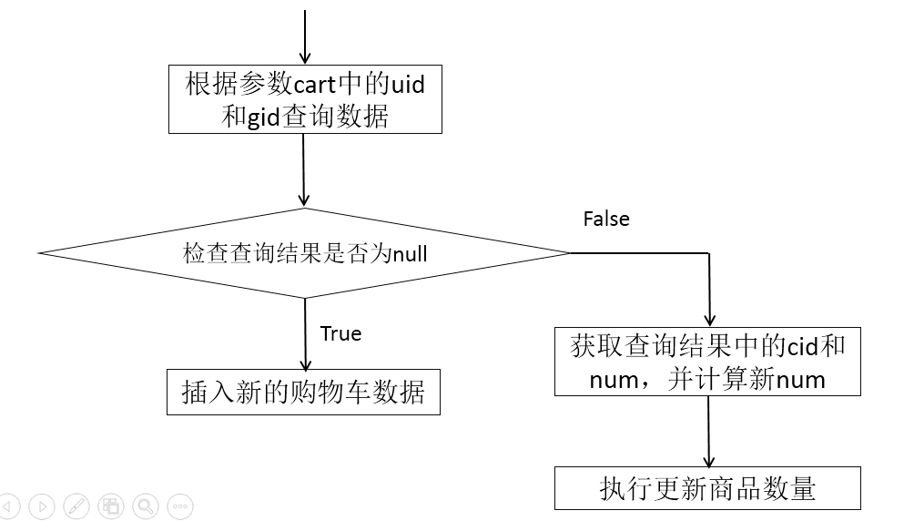

### 48. 显示商品详情-持久层

**1. 规划SQL语句**

查询商品详情的SQL语句大致是：

	SELECT title,sell_point,image,price FROM t_goods WHERE id=?

**2. 接口与抽象方法**

在接口中声明抽象方法：

	Goods findById(Long id);

**3. 配置映射**

在`GoodsMapper.xml`中配置以上抽象方法的映射：

	<!-- 根据商品id查询商品详情 -->
	<!-- Goods findById(Long id) -->
	<select id="findById"
		resultType="cn.tedu.store.entity.Goods">
		SELECT 
			title,
			price,image,
			sell_point AS sellPoint
		FROM 
			t_goods 
		WHERE 
			id=#{id} 
	</select>

在`GoodsMapperTestCase`中编写并执行单元测试：

	@Test
	public void findById() {
		Long id = 10000017L;
		Goods data = mapper.findById(id);
		System.err.println(data);
	}

### 49. 显示商品详情-业务层

**1. 规划异常**

无

**2. 接口与抽象方法**

在`IGoodsService`接口中，将`GoodsMapper`中的方法复制粘贴过来，并将方法名中的`find`改成`get`：

	/**
	 * 根据商品id查询商品详情
	 * @param id 商品id
	 * @return 匹配的商品详情，如果没有匹配的数据，则返回null
	 */
	Goods getById(Long id);

**3. 实现**

在`GoodsServiceImpl`实现类中，将`GoodsMapper`中的方法复制粘贴过来，添加`private`权限，并调用持久层对象实现该方法：

	/**
	 * 根据商品id查询商品详情
	 * @param id 商品id
	 * @return 匹配的商品详情，如果没有匹配的数据，则返回null
	 */
	private Goods findById(Long id) {
		return goodsMapper.findById(id);
	}

在`GoodsServiceImpl`实现类中，重写`IGoodsService`接口中定义的抽象方法，并调用自身的私有方法实现：

	@Override
	public Goods getById(Long id) {
		return findById(id);
	}

完成后，在`GoodsServiceTestCase`中编写并执行单元测试：

	@Test
	public void findById() {
		Long id = 10000017L;
		Goods data = service.getById(id);
		System.err.println(data);
	}

### 50. 显示商品详情-控制器层

**1. 处理异常**

无

**2. 设计请求**

	请求路径：/goods/{id}/details
	请求参数：无
	请求类型：GET
	响应数据：ResponseResult<Goods>
	是否拦截：否，需要在白名单中检查 /goods/**

**3. 处理请求**

	@GetMapping("{id}/details")
	public ResponseResult<Goods> getById(
		@PathVariable("id") Long id) {
		// 调用业务层对象执行查询
		// 响应“成功”和查询结果
	}

具体实现为：

	@GetMapping("{id}/details")
	public ResponseResult<Goods> getById(
		@PathVariable("id") Long id) {
		// 调用业务层对象执行查询
		Goods data = goodsService.getById(id);
		// 响应“成功”和查询结果
		return new ResponseResult<>(SUCCESS, data);
	}

完成后，打开浏览器，不登录，直接通过`http://localhost:8080/goods/10000017/details`进行测试。

### 51. 显示商品详情-前端界面

首先，应该保证`product.html`是可以被不登录的情况下直接访问的，也就是需要将`/web/product.html`添加到拦截器的白名单中！

然后，确保在主页中点击热销排行中的链接时，URL中包含`id=xxx`。则需要先从FTP下载`jquery-getUrlParam.zip`文件，解压得到`jquery-getUrlParam.js`文件，将该文件复制粘贴到项目的`static`下的`js`文件夹中，并打开`product.html`页面，添加引用该文件的代码：

	

当添加了引用js文件后，可以检查该函数是否可以正确的获取到值：

	

### 52. 购物车-数据表

创建购物车的数据表：

	CREATE TABLE t_cart(
		cid INT AUTO_INCREMENT COMMENT '购物车数据的id',
		uid INT COMMENT '用户的id',	
		gid BIGINT COMMENT '商品id',
		num INT COMMENT '商品数量',
		created_user VARCHAR(20) COMMENT '创建者',
		created_time DATETIME COMMENT '创建时间',
		modified_user VARCHAR(20) COMMENT '最后修改者',
		modified_time DATETIME COMMENT '最后修改时间',
		PRIMARY KEY(cid)
	) DEFAULT CHARSET=UTF8;

### 53. 购物车-实体类

创建`cn.tedu.store.entity.Cart`实体类，继承自`BaseEntity`类：

	/**
	 * 购物车数据的实体类
	 */
	public class Cart extends BaseEntity {
		
		private static final long serialVersionUID = -2692377799099693032L;
		
		private Integer cid;
		private Integer uid;
		private Long gid;
		private Integer num;

		// SET/GET
	}

### 54. 购物车-加入购物车-持久层

**1. 分析SQL语句**

往购物车表中插入新的数据需要执行SQL语句大致是：

	INSERT INTO t_cart (除了cid以外的字段列表) VALUES (值列表)

但是，“加入购物车”并不是每次都在购物车数据表中产生新的数据，如果是反复加入，则后续的每次操作只会增加数量：

	UPDATE t_cart SET num=? WHERE cid=?

完整版应该是：

	UPDATE t_cart  SET num=?,modified_user=?,modified_time=? WHERE cid=?

除此以外，还要能够判断得到“当前应该INSERT还是UPDATE”，其判断标准应该是“该用户原本购物车没有添加该商品，则INSERT，如果已有该商品，则UPDATE”，则“根据用户id和商品id查询购物车数据表即可”：

	SELECT cid, num FROM t_cart WHERE uid=? AND gid=?

本次查询根本不需要查询任何字段的值，只需要知道查询结果是否为null即可！但是，如果查询结果非null，表示该用户已经将该商品添加到购物车，需要更新数量，则需要根据用户提交的增量和原有数量计算得到新的商品数量，则需要查询出原有数量，同时，还要查出这条数据的id，以执行以上UPDATE语句。

**2. 接口与抽象方法**

创建`cn.tedu.store.mapper.CartMapper`接口，并添加抽象方法：

	Integer addnew(Cart cart);

	Integer updateNum(Integer cid, Integer num, String modifiedUser, Date modifiedTime);

	Cart findByUidAndGid(Integer uid, Long gid);

**3. 配置映射**

复制得到`CartMapper.xml`并配置：

	<mapper namespace="cn.tedu.store.mapper.CartMapper">
	
		<!-- 增加新的购物车数据 -->
		<!-- Integer addnew(Cart cart) -->
		<insert id="addnew"
			useGeneratedKeys="true"
			keyProperty="cid">
			INSERT INTO t_cart (
				uid,
				gid, num,
				created_user, created_time,
				modified_user, modified_time
			) VALUES (
				#{uid},
				#{gid}, #{num},
				#{createdUser}, #{createdTime},
				#{modifiedUser}, #{modifiedTime}
			)
		</insert>
		
		<!-- 更新购物车中商品的数量 -->
		<!-- Integer updateNum(
			@Param("cid") Integer cid, 
			@Param("num") Integer num, 
			@Param("modifiedUser") String modifiedUser, 
			@Param("modifiedTime") Date modifiedTime) -->
		<update id="updateNum">
			UPDATE 
				t_cart 
			SET 
				num=#{num},
				modified_user=#{modifiedUser},
				modified_time=#{modifiedTime} 
			WHERE 
				cid=#{cid}
		</update>
		
		<!-- 根据用户id和商品id查询购物车数据 -->
		<!-- Cart findByUidAndGid(
			@Param("uid") Integer uid, 
			@Param("gid") Long gid) -->
		<select id="findByUidAndGid"
			resultType="cn.tedu.store.entity.Cart">
			SELECT 
				cid,num
			FROM 
				t_cart
			WHERE 
				uid=#{uid} AND gid=#{gid}
		</select>
		
	</mapper>

并编写执行单元测试：

	@RunWith(SpringRunner.class)
	@SpringBootTest
	public class CartMapperTestCase {
		
		@Autowired
		CartMapper mapper;
		
		@Test
		public void addnew() {
			Cart cart = new Cart();
			cart.setUid(1);
			cart.setGid(2L);
			cart.setNum(3);
			Integer rows = mapper.addnew(cart);
			System.err.println("rows=" + rows);
		}
		
		@Test
		public void updateNum() {
			Integer cid = 1;
			Integer num = 50;
			String modifiedUser = "系统管理员";
			Date modifiedTime = new Date();
			Integer rows = mapper.updateNum(cid, num, modifiedUser, modifiedTime);
			System.err.println("rows=" + rows);
		}
		
		@Test
		public void findByUidAndGid() {
			Integer uid = 1;
			Long gid = 2L;
			Cart cart = mapper.findByUidAndGid(uid, gid);
			System.err.println(cart);
		}
	
	}

### 55. 购物车-加入购物车-业务层

**1. 规划异常**

此次的操作可能是INSERT操作，也可能是UPDATE操作，所以，可能抛出`InsertException`或`UpdateException`。

此次的查询并不导致任何错误，无论是否查询到匹配的结果，都是正确的！则不涉及异常！

**2. 接口与抽象方法**

创建`cn.tedu.store.service.ICartService`接口，并添加抽象方法：

	void addToCart(Cart cart, String username) throws InsertException, UpdateException;

**3. 实现**

创建`cn.tedu.store.service.impl.CartServiceImpl`类，实现`ICartService`接口，在类之前添加`@Service`注解，在类中添加`@Autowired private CartMapper cartMapper;`持久层对象。

然后，私有化实现持久层的3个方法。

最后，实现接口中的抽象方法的流程大致为：

规划开发步骤：

	public void addToCart(Cart cart, String username) throws InsertException, UpdateException {
		// 根据参数cart中的uid和gid执行查询
		// 判断查询结果是否为null
		// 是：表示当前用户并没有将当前商品添加到购物车，则执行增加
		// 否：表示当前用户的购物车中已有该商品，则取出该数据的cid和num
			// 根据参数cart中的num和刚才查询结果中取出的num，计算得到新的num
			// 执行更新
	}

具体实现为：

	/**
	 * 处理购物车数据的业务层实现类
	 */
	@Service
	public class CartServiceImpl implements ICartService {
		
		@Autowired
		private CartMapper cartMapper;
	
		@Override
		public void addToCart(Cart cart, String username) throws InsertException, UpdateException {
			// 根据参数cart中的uid和gid执行查询
			Integer uid = cart.getUid();
			Long gid = cart.getGid();
			Cart result = findByUidAndGid(uid, gid);
			Date now = new Date();
			// 判断查询结果是否为null
			if (result == null) {
				// 是：表示当前用户并没有将当前商品添加到购物车，则执行增加
				cart.setCreatedUser(username);
				cart.setCreatedTime(now);
				cart.setModifiedUser(username);
				cart.setModifiedTime(now);
				addnew(cart);
			} else {
				// 否：表示当前用户的购物车中已有该商品，则取出该数据的cid和num
				Integer cid = result.getCid();
				Integer num = result.getNum();
				// 根据参数cart中的num和刚才查询结果中取出的num，计算得到新的num
				Integer newNum = cart.getNum() + num;
				// 执行更新
				updateNum(cid, newNum, username, now);
			}
		}
		
		/**
		 * 增加新的购物车数据
		 * @param cart 购物车数据
		 */
		private void addnew(Cart cart) {
			Integer rows = cartMapper.addnew(cart);
			if (rows != 1) {
				throw new InsertException(
					"将商品添加到购物车失败！插入数据时出现未知错误！");
			}
		}
	
		/**
		 * 更新购物车中商品的数量
		 * @param cid 购物车数据的id
		 * @param num 商品的新数量
		 * @param modifiedUser 修改执行人
		 * @param modifiedTime 修改时间
		 */
		private void updateNum(Integer cid, Integer num, 
			String modifiedUser, Date modifiedTime) {
			Integer rows = cartMapper.updateNum(cid, num, modifiedUser, modifiedTime);
			if (rows != 1) {
				throw new UpdateException(
					"将商品添加到购物车失败！更新数据时出现未知错误！");
			}
		}
	
		/**
		 * 根据用户id和商品id查询购物车数据
		 * @param uid 用户id
		 * @param gid 商品id
		 * @return 匹配的购物车数据，如果没有匹配的数据，则返回null
		 */
		private Cart findByUidAndGid(
				Integer uid, Long gid) {
			return cartMapper.findByUidAndGid(uid, gid);
		}
		
	}

创建`CartServiceTestCase`测试类，编写并执行单元测试：

	@RunWith(SpringRunner.class)
	@SpringBootTest
	public class CartServiceTestCase {
		
		@Autowired
		ICartService service;
		
		@Test
		public void addToCart() {
			try {
				Cart cart = new Cart();
				cart.setUid(10);
				cart.setGid(20L);
				cart.setNum(30);
				String username = "Admin";
				service.addToCart(cart, username);
				System.err.println("OK.");
			} catch (ServiceException e) {
				System.err.println(e.getClass().getName());
				System.err.println(e.getMessage());
			}
		}
		
	}

### 56. 购物车-加入购物车-控制器层

**1. 处理异常**

无

**2. 设计请求**

	请求路径：/carts/add_to_cart
	请求参数：Cart cart, HttpSession session
	请求类型：POST
	响应数据：ResponseResult<Void>
	是否拦截：是，无需修改配置

**3. 处理请求**

创建`cn.tedu.store.controller.CartController`，继承自`BaseController`，在类之前添加`@RestController`和`@RequestMapping("carts")`注解，并在类中声明`@Autowired private ICartService cartService;`业务层对象。

然后，添加处理请求的方法：

	@RequestMapping("add_to_cart")
	public ResponseResult<Void> addToCart(Cart cart, HttpSession session) {
		// 获取uid和username
		// 将uid封装到参数cart中
		// 调用业务层对象执行加入购物车功能
		// 响应成功
	}

完成后，通过`http://localhost:8080/carts/add_to_cart?gid=10000001&num=1`进行测试，如果没有登录就执行测试，会被重定向到登录页，登录成功再次测试即可。
